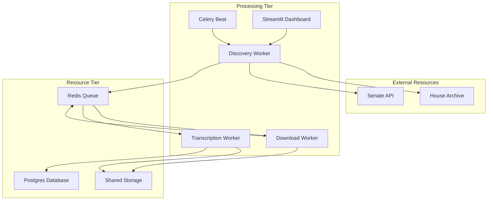

# StateAffair - Video Processing Pipeline

A microservice-based system for the automated discovery, downloading, and transcription of Michigan House and Senate legislative videos.

## System Architecture

StateAffair is built on a decoupled, task-driven architecture organized into three tiers.



---

## Key Features

### Download Pipeline
The download pipeline uses yt-dlp and aria2c for fragmented downloading.
- Opens up to 16 simultaneous connections per video.
- Decoupled stream resolution using pattern matching for House and a Playwrite resolution API for Senate.

### Transcription
Supports multiple AI transcription providers with a unified formatting layer:
- Google Gemini 3.0 Flash/Pro with relative timestamps.
- OpenAI Whisper API with speaker identification.
- Local Whisper runs on local CPU/GPU.

### Searchable Transcription Registry
All transcripts are stored in PostgreSQL.
- Transcripts include word-level metadata and speaker labels.
- Automated SafeMigrator manages database schema updates across all services.

### Video Viewer
Streamlit interface for interacting with the pipeline:
- Browse transcribed sessions with a filterable registry.
- Read transcripts alongside a synchronized video player.
- Seeking to specific moments by clicking timestamps in the transcript.

---

## Data Storage

The data/ directory serves as a local persistent volume for videos, audio, and transcripts. In this development environment, it is used to map what will become an S3 bucket in a production deployment.

---

## Deployment & Scaling

### Quick Start
Ensure Docker and Docker Compose are installed, then run:

```bash
# 1. Prepare environment
cp .env.example .env  # Add API keys

# 2. Build and launch everything
make build
```

### Manual Controls
- make launch: Starts containers and opens the dashboard.
- make stop: Stops services.
- make logs: Follows logs from microservices.

### Scaling
The system supports horizontal scaling via Docker Compose:

```bash
# Scale to 3 downloaders and 5 transcribers
docker compose up -d --scale download-worker=3 --scale transcription-worker=5
```

---

## Configuration (.env)

| Variable | Description | Default |
|----------|-------------|---------|
| DOWNLOAD_CONCURRENCY | Tasks per download container | 1 |
| TRANSCRIPTION_CONCURRENCY | Tasks per transcription container | 1 |
| TRANSCRIPTION_PROVIDER | local, openai, or gemini | local |
| WHISPER_MODEL | Size of local model (e.g., base, small) | base |
| GEMINI_MODEL | Model name (e.g., gemini-3-flash-preview) | |

---

## Automation & Reliability

### Automated Discovery
Celery Beat polls legislative archives every hour. It identifies the gap between the latest successfully downloaded video and the current date.

### Recovery Mechanism
The system includes an automated mechanism to manage task lifecycle:
- Detects tasks stuck in progress for more than 30 minutes.
- Resets and requeues failed tasks up to 3 times.
- Error reporting is captured in the Video Registry.

---

## Project Structure

```
StateAffair-Interview/
├── src/
│   ├── workers/        # Celery App & Task Definitions
│   ├── services/       # Discovery, Download, Transcription logic
│   ├── scrapers/       # Site-specific scraping & resolution
│   ├── dashboard/      # Streamlit UI
│   ├── database/       # SQLAlchemy models & SafeMigrator
│   └── utils/          # Logging, Config, Audio Extraction
├── data/               # Persistent shared storage (S3 mapping)
├── docker-compose.yaml # Microservice orchestration
└── Makefile            # Simplified dev commands
```
